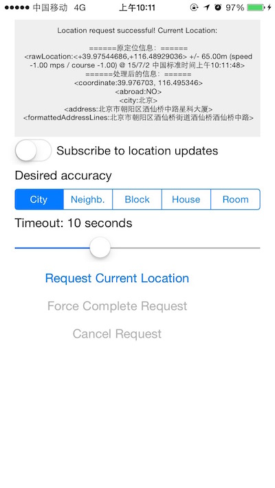

# LocationManager

####获取位置信息并进行地理反编码，已做了纠偏处理。

## Screenshot

## Usage
####iOS8.0以下系统

需要在info.plist中加入一个key为 NSLocationUsageDescription 的定位说明。

####iOS8及以上系统

需要在info.plist中加入使用期间的定位说明key:  NSLocationWhenInUseUsageDescription
或者持续定位说明key: NSLocationAlwaysUsageDescription